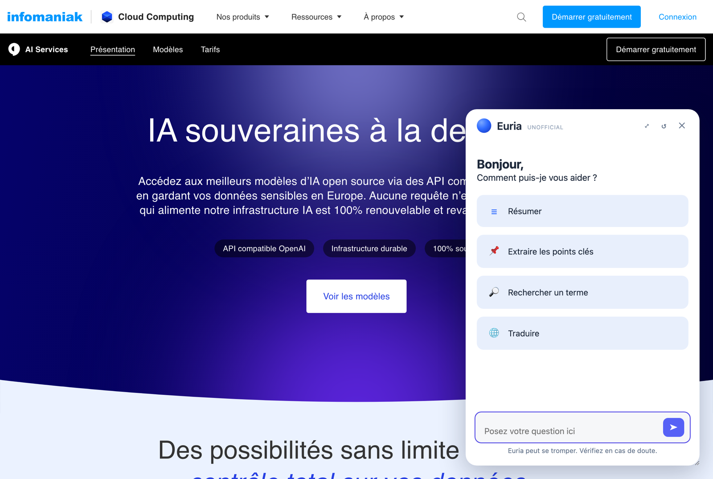
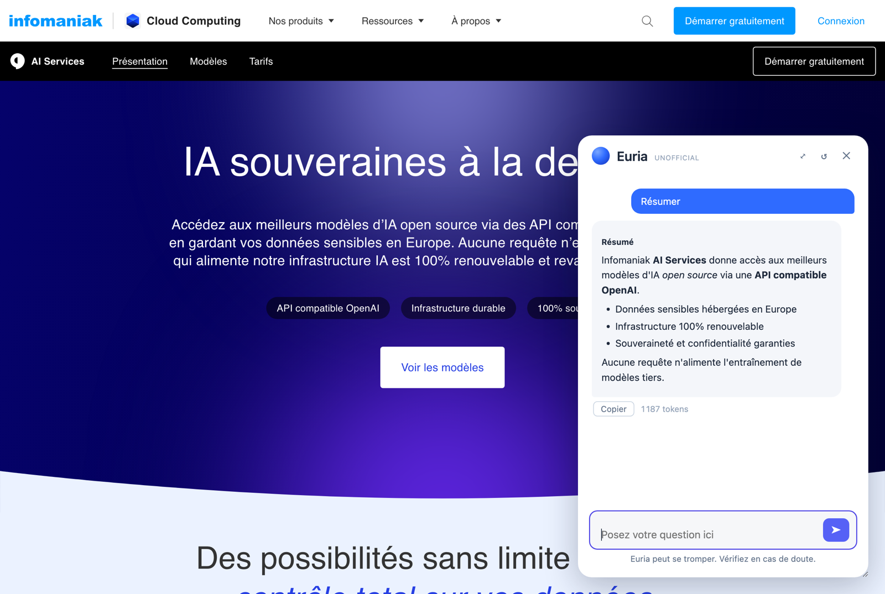
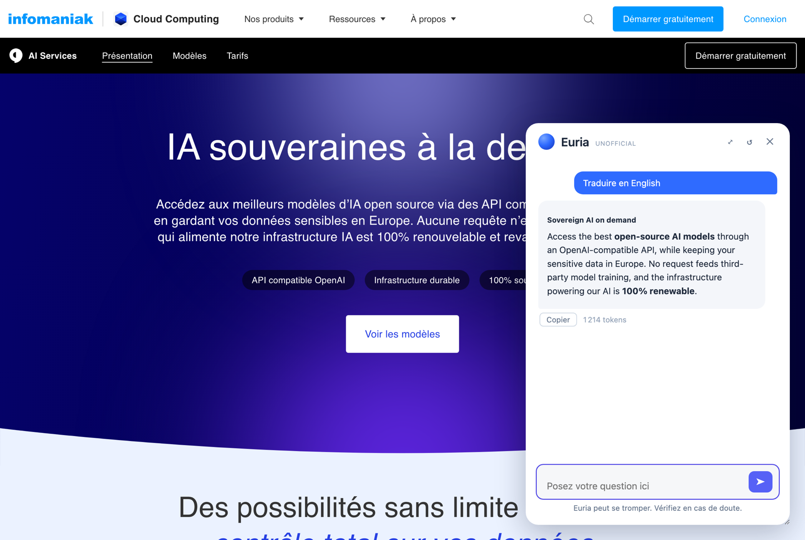
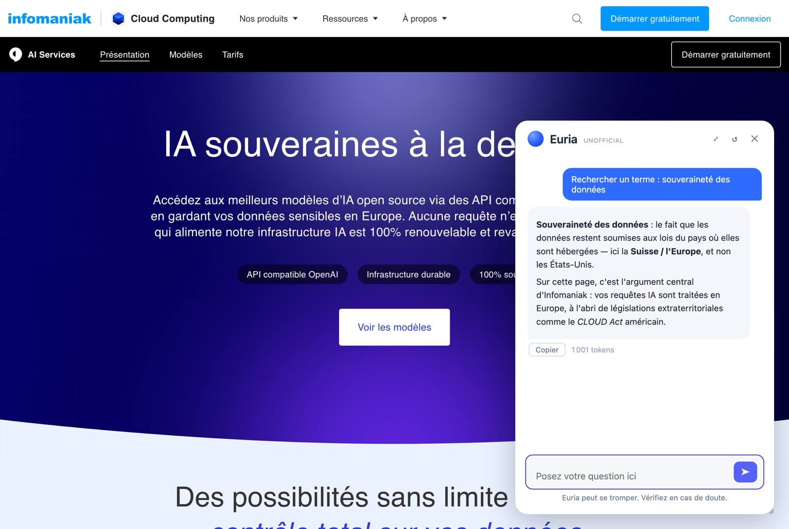

# Euria Everywhere (Unofficial)

> Extension **non officielle**, non affiliée à Infomaniak. « Euria » est le nom de l'assistant IA d'Infomaniak ; cette extension reproduit son expérience sur n'importe quelle page web via votre propre accès à l'API Infomaniak AI Tools.

Fonctionnalités : **Résumer**, **Extraire les points clés**, **Rechercher un terme**, **Traduire**, questions libres avec suivi de conversation — réponses en streaming. Compatible **Firefox** (≥ 127) et **Brave / Chromium** (≥ 116).



| Résumé | Points clés |
|:---:|:---:|
|  |  |
| **Traduction** | **Rechercher un terme** |
|  |  |

> Captures d'illustration ; la page servant de décor et le nom « Euria » appartiennent à Infomaniak.

## Installation

Le plus simple : télécharger le paquet prêt à l'emploi depuis la [dernière release](https://github.com/jsiikme/euria-everywhere/releases/latest) — **aucun build nécessaire**. Décompressez le ZIP correspondant à votre navigateur, puis :

**Firefox** (`…-firefox.zip`)
1. Ouvrir `about:debugging#/runtime/this-firefox`
2. **« Charger un module complémentaire temporaire… »** → sélectionner le `manifest.json` du dossier décompressé

L'extension reste chargée jusqu'au redémarrage de Firefox. Pour du permanent : signature via [addons.mozilla.org](https://addons.mozilla.org) (`web-ext sign`) ou Firefox Developer Edition avec `xpinstall.signatures.required = false`.

**Brave / Chromium** (`…-brave.zip`)
1. Ouvrir `brave://extensions` (ou `chrome://extensions`)
2. Activer le **Mode développeur** (interrupteur en haut à droite)
3. **« Charger l'extension non empaquetée »** → sélectionner le dossier décompressé

L'installation persiste entre les redémarrages. Sous Chromium, la permission `api.infomaniak.com` est accordée automatiquement à l'installation (pas d'étape supplémentaire, contrairement à Firefox < 127).

## Construire depuis les sources

Uniquement si vous partez du clone git (pour développer). Firefox et Chromium exigent des `manifest.json` différents et incompatibles (event page vs service worker, SVG vs PNG) ; `build.sh` assemble un dossier propre par navigateur :

```sh
./build.sh   # produit dist/firefox et dist/brave
```

Chargez ensuite `dist/firefox` ou `dist/brave` comme ci-dessus. (À défaut, `dist/` n'est pas versionné.)

## Utilisation

- **Bouton de la barre d'outils** ou **`Alt+Shift+E`** : ouvre/ferme le panneau sur la page courante.
- **Clic droit** → menu **Euria** : résumer / points clés / traduire la page ; sur une sélection : résumer, rechercher le terme, traduire.
- Panneau **déplaçable** (glisser l'en-tête) et **redimensionnable** (coin inférieur droit) ; position et taille mémorisées. **Mode sombre** automatique.
- Chaque réponse : bouton **Copier** + consommation de **tokens** affichée.
- Le raisonnement du modèle (Qwen3.5 « réfléchit » avant de répondre) est disponible dans un bloc repliable pour les questions libres ; il est **désactivé pour les actions prédéfinies** (résumé, traduction…) — réponses plus rapides et moins de tokens facturés.

## Configuration

Préférences (`about:addons` → Euria Everywhere → Préférences) :

- **URL de l'API** : endpoint OpenAI-compatible Infomaniak (`/2/ai/<product_id>/openai/v1/chat/completions`)
- **Jeton API** : jeton Bearer Infomaniak AI Tools
- **Modèle** : ex. `Qwen/Qwen3.5-122B-A10B-FP8`
- **Taille max.** du contenu de page envoyé (24 000 caractères par défaut)

## Jeton API et sécurité

- Aucun jeton n'est embarqué dans le code. Au premier lancement (ou si le jeton manque), la page de préférences s'ouvre automatiquement : collez-y votre jeton Infomaniak AI Tools. Il est stocké dans `storage.local`, local à votre profil Firefox.
- **L'URL d'API est verrouillée sur `https://api.infomaniak.com/`** (validée dans les options ET avant chaque requête) : le jeton ne peut pas être envoyé vers un autre domaine.
- Le contenu de la page est transmis comme **données délimitées dans un message utilisateur**, pas dans le prompt système, pour limiter la prompt injection par des pages malveillantes.
- Firefox ≥ 127 requis : l'API ne renvoie pas d'en-têtes CORS, l'extension dépend donc de la permission hôte `api.infomaniak.com` (accordée à l'installation depuis Firefox 127 ; si elle est révoquée, l'extension l'explique au lieu d'échouer silencieusement).

## Choix techniques

- **Injection à la demande** : le script de contenu n'est pas déclaré sur `<all_urls>` ; il est injecté (via `activeTab` + `scripting`) seulement quand vous sollicitez l'extension. Empreinte mémoire nulle sur les onglets où Euria n'est pas utilisé.
- **Extraction de page filtrée** : seuls les blocs de texte utiles et visibles (paragraphes, titres, listes…) sont envoyés — navigation, pieds de page et éléments cachés sont exclus, ce qui réduit le bruit et les tokens.
- **Économie de contexte** : contenu de page limité (réglable) et historique tronqué aux 8 derniers messages à chaque appel.
- **Streaming robuste** : rendu limité à un re-rendu par frame (`requestAnimationFrame`), deltas de raisonnement relayés par paquets, retry automatique avec backoff sur HTTP 429/5xx + bouton « Réessayer ».
- **Panneau en Shadow DOM** (mode `closed`) : styles isolés du site visité, `z-index` maximal.
- **Bilingue automatique** : l'interface, les menus, les prompts modèle et la page de préférences basculent en anglais si la langue du navigateur n'est pas le français (français sinon). Aucun réglage à faire.

## Structure

| Fichier | Rôle |
|---|---|
| `manifest.json` | Manifest V3 Firefox (≥ 127) : event page, icône SVG |
| `manifest.chromium.json` | Manifest V3 Brave/Chromium (≥ 116) : service worker, icônes PNG |
| `defaults.js` | Valeurs par défaut partagées + polyfill `browser` pour Chromium (jamais persistées) |
| `background.js` | Menus, raccourci, injection à la demande, appels API SSE avec retry |
| `content.js` | Panneau flottant (Shadow DOM), extraction de page, rendu Markdown |
| `options.html/js` | Page de préférences (URL, jeton, modèle, taille max.) avec validation |
| `build.sh` | Construit `dist/firefox` et `dist/brave` |

Le code applicatif est 100 % partagé : `defaults.js` aliasse `browser = chrome` sous Chromium (les API `chrome.*` renvoient des promesses en MV3), et `background.js` se charge via `background.scripts` (Firefox) ou `importScripts` dans le service worker (Chromium). Nuance service worker : Chromium peut suspendre le worker après ~30 s d'inactivité, mais les messages du port et le fetch en cours le maintiennent éveillé pendant un stream ; en cas de suspension imprévue, le panneau affiche une erreur avec « Réessayer » au lieu d'un spinner infini.
